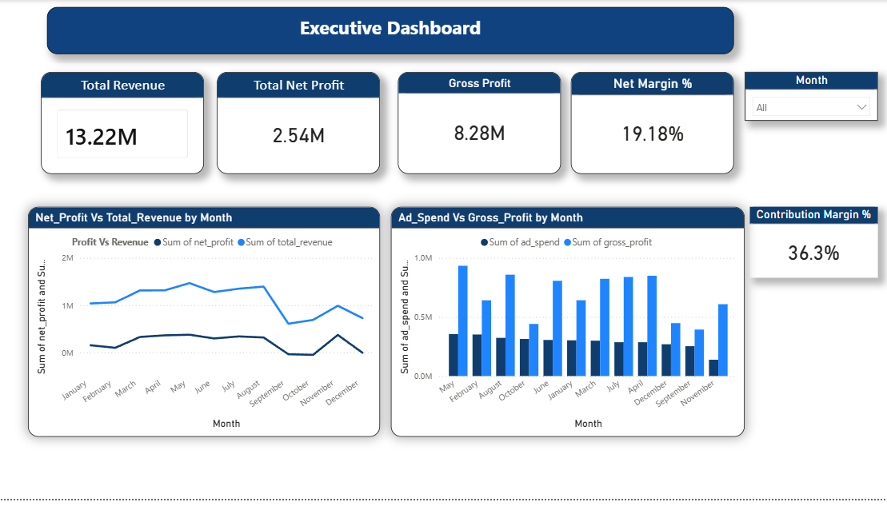
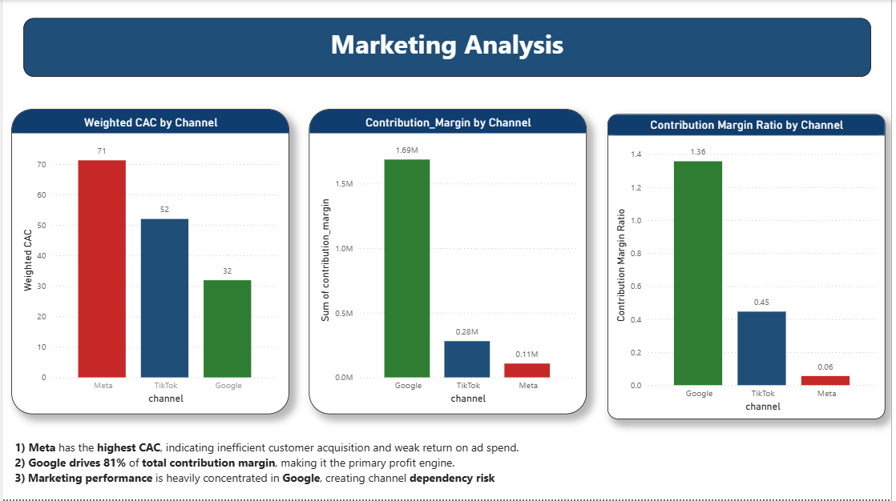
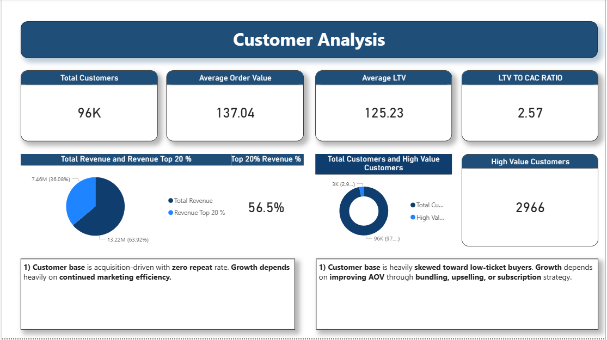

# Ecommerce Profit Optimizer

Financial Intelligence Dashboard for DTC Brands

This project analyzes a $13M ecommerce dataset to uncover marketing efficiency, customer value, and profitability drivers.

---

## Tools Used
- SQL
- PostgreSQL
- Power BI
- Python
- Streamlit

---

## Executive Dashboard

---

## Marketing Analysis

---

## Customer Intelligence

---

## Key Insights

- Google generates **81% of contribution margin**
- Top 20% of customers generate **56.5% of revenue**
- Zero repeat rate → acquisition dependent model
